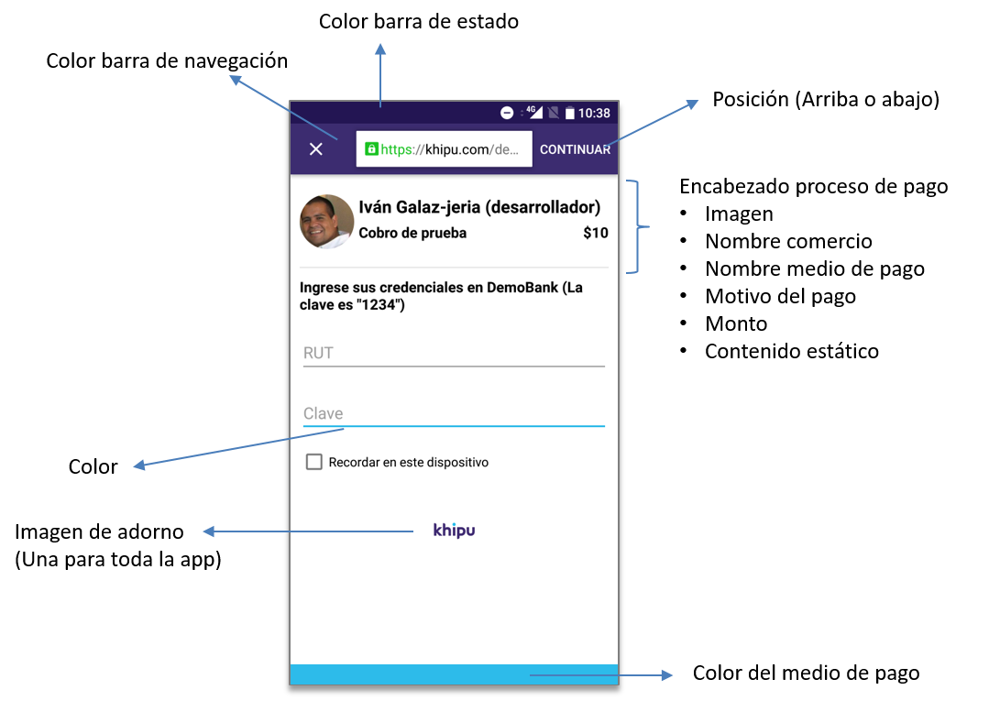

# Browser2app

Browser2app es un servicio, provisto por khipu, que permite integrar flujos de trabajo web en aplicaciones nativas de Android e iOS con experiencia nativa sin hacer modificaciones al backend ni frontend existente. Por ejemplo, es posible que una app de compra integre todo el flujo de autorización de pago dentro de su app, sin necesidad de enviar al usuario a autorizar el pago a un navegador o abrir un WebView.

El servicio se compone de tres partes.

1. Biblioteca nativa, que debes integrar a tu app, existen versiones para iOS y para Android.
2. Servidor de autómatas, que puede estar alojado en tus instalaciones o las nuestras.
3. Servicio de configurción y mantención de autómatas.

En Browser2app existen varios niveles de configuración de la experiencia del usuario, algunos son controlados por el servidor de autómatas y se definen en la implementación del proyecto, otros se definen al momento de inicializar la biblioteca y finalmente otros se definen para cada instancia de una operación, la siguiente imágen muestra parte de los que se puede configurar.




Si estás interesado en utilizar Browser2app en tu app, [contáctanos](mailto:soporte@khipu.com)

# Manual de uso la biblioteca nativa Browser2app en iOS (pod khenshin) 

Esta aplicación ha sido creada para demostrar la utilización de nuestra biblioteca khenshin. Para poder ejecutar esta aplicación es necesario que tengas acceso a nuestro repositorio privado(*): *https://bitbucket.org/khipu/khenshin-pod.git*

Los pasos necesarios para utilizar la biblioteca nativa iOS para Browser2app son:

1. [Configurar frameworks](#frameworks)
2. [Agregar cocoapod khenshin](#cocoapod)
3. [Flags de compilación](#add--objc)
4. [Inicialización de la biblioteca](#inicializacion)
5. [Invocar browser2app desde tu app](#parámetros-de-invocación)

## Frameworks
* libxml2. Es necesario agregar esta biblioteca a tu proyecto antes de compilar con khenshin
 
## Cocoapod
Para instalar khenshin en tu proyecto es necesario utilizar cocoapods.
> **Archivo Podfile**  
> pod 'khenshin', :git => 'https://bitbucket.org/khipu/khenshin-pod.git', :tag => '1.40'

*Importante* **use_frameworks!**

## Add -Objc  
Valida que tu proyecto tenga configurada la bandera -Objc

> Project -> Build Settings -> Other Linker Flags -> *-Objc*

# Inicialización 
## Recursos
En *AppDelegate.m* puedes ver la inicialización de **khenshin**:  

* **NavigationBarCenteredLogo**: imagen para ubicarla al centro de la barra de navegación durante la inicialización.  
* **NavigationBarLeftSideLogo**: imagen para ubicarla a la izquierda de la barra de navegación en caso que se habilite **"Mira Como Funciona"**.  
* **AutomatonAPIURL**: dirección URL para descargar los autómatas(*).
* **CerebroAPIURL**: dirección URL para informar de progreso de pago(*).
* **processHeader**: Si has diseñado tu propio encabezado para el proceso de pago, éste es el parámetro para entregar una vista que implemente el protocolo *ProcessHeader*.
* **processFailure**: Si has diseñado tu propia vista de fallo, éste es el parámetro para entregar un controlador que implemente el protocolo *ProcessExit*.
* **processSuccess**: Si has diseñado tu propia vista de éxito, éste es el parámetro para entregar un controlador que implemente el protocolo *ProcessExit*.
* **processWarning**: Si has diseñado tu propia vista de advertencia, éste es el parámetro para entregar un controlador que implemente el protocolo *ProcessExit*.
* **allowCredentialsSaving**: permites guardar credenciales. Por omisión es falso.
* **mainButtonStyle**: tipo de botón "Continuar". Las opciones se encuentran en "KhenshinEnums.h". Por omisión el botón va en la barra de navegación.
* **hideWebAddressInformationInForm**: permite esconder el UITextField que muestra información de la dirección web en que se encuentra el usuario. Por omisión se muestra esta información.
* **useBarCenteredLogoInForm**: En caso que se esconda la información de dirección puedes utilizar el logo *NavigationBarCenteredLogo* como relleno.
* **principalColor**: Para pintar la barra de navegación y el botón principal.
* **darkerPrincipalColor**: Para pintar el color secundario del botón principal.
* **secondaryColor**: asigna el TintColor de UIButton.
* **navigationBarTextTint**: asigna el TintColor de UINavigationBar.
* **font**: Si deseas asignar una fuente a khenshin.

**En esta versión, si no quieres utilizar imágenes puedes asignar una imagen vacía**

> [[UIImage alloc] init]

(*) Éstos datos serán entregados por tu *ejecutivo* ***Browser2app***

## Ejemplo de Inicialización
**Detalle se encuentra en AppDelegate.m**

```
[KhenshinInterface initWithNavigationBarCenteredLogo:[UIImage imageNamed:@"Bar Logo"]
                           NavigationBarLeftSideLogo:[[UIImage alloc] init]
                                     automatonAPIURL:[self safeURLWithString: AUTOMATA_API_URL]
                                       cerebroAPIURL:[self safeURLWithString: CEREBRO_API_URL]
                                       processHeader:(UIView<ProcessHeader>*)[self processHeader]
                                      processFailure:nil
                                      processSuccess:nil
                                      processWarning:(UIViewController<ProcessExit>*)[self warningViewController]
                              allowCredentialsSaving:NO
                                     mainButtonStyle:KHMainButtonFatOnForm
                     hideWebAddressInformationInForm:NO
                            useBarCenteredLogoInForm:NO
                                      principalColor:[self principalColor]
                                darkerPrincipalColor:[self darkerPrincipalColor]
                                      secondaryColor:[self secondaryColor]
                               navigationBarTextTint:[self navigationBarTextTint]
                                                font:[UIFont fontWithName:@"Avenir Next Condensed" size:15.0f]];

```
***safeURLWitString*** es un método que construye una URL con el String recibido codificándolos correctamente para direcciones web. 

Puedes configurar el estilo de la barra de estado.

* **PreferredStatusBarStyle**.

```
[KhenshinInterface setPreferredStatusBarStyle:UIStatusBarStyleLightContent];
```

## Parámetros de Invocación
Khenshin se puede invocar de dos maneras. La primera es a partir de un pago generado con [la API de creación de pagos](https://khipu.com/page/api) de khipu y la segunda es a partir de un identificador de autómata y un diccionario de parámetros.

### Invocación a partir de un pago generado en khipu.com
*Opcionales para ejecución*
 
* **userIdentifier**: se utiliza para generar un identificador único del usuario. Permite guardar y leer credenciales del medio de pago en caso que el usuario elijas guardarlas.

*Requeridos para ejecución*

* **PaymentExternalId**: Código de cobro entregado por khipu.com.  
* **isExternalPayment**: define que el pago se está realizando desde una aplicación distinta de khipu.
* **Success**: proceso a ejecutar cuando termina exitosamente el proceso de pago.  
* **Failure**: proceso a ejecutar cuando termina con fallas el proceso de pago.  

#### Ejemplo de Ejecución
**Detalle se encuentra en ViewController.m**  

```
[KhenshinInterface startEngineWithPaymentExternalId:ID_DE_PAGO
                                     userIdentifier:@""
                                  isExternalPayment:YES
                                            success:^(NSURL *returnURL) {
                                                        
                                                NSLog(@"Success");
                                                NSLog(@"Retornamos con URL: %@", [returnURL absoluteString]);
                                            }
                                            failure:^(NSURL *returnURL) {
                                                        
                                                NSLog(@"Failure");
                                                NSLog(@"Retornamos con URL: %@", [returnURL absoluteString]);
                                            }
                                           animated:YES];
```
El Id de pago se debe obtener luego de crear un pago ver [la API de creación de pagos](https://khipu.com/page/api)

### Invocación a partir de un identificador de autómata y parámetros del proceso.
*Opcionales para ejecución*
 
* **userIdentifier**: se utiliza para generar un identificador único del usuario. Permite guardar y leer credenciales del medio de pago en caso que el usuario elijas guardarlas.

*Requeridos para ejecución*

* **AutomatonId**: identificado entregas por khipu (*).
* **parameters**: opciones entregadas para el pago (*).
* **Success**: proceso a ejecutar cuando termina exitosamente el proceso de pago.  
* **Failure**: proceso a ejecutar cuando termina con fallas el proceso de pago.  

```
[KhenshinInterface startEngineWithAutomatonId:ID_DE_AUTOMATA
                                     animated:YES
                                   parameters:@{PARAM_1: VALOR_PARAM_1,
                                                PARAM_2: VALOR_PARAM_2,
                                                PARAM_3: VALOR_PARAM_3,
                                                ...
                                                PARAM_N: VALOR_PARAM_N}
                               userIdentifier:nil
                                      success:^(NSURL *returnURL) {
                                          
                                          NSLog(@"Volver con ¡éxito!");
                                      } failure:^(NSURL *returnURL) {
                                          
                                          NSLog(@"Volver con fracaso :(");
                                      }];
```
(*) Tu *ejecutivo* ***Browser2app*** te informará las opciones para el ID\_DE\_AUTOMATA y los PARAM\_1 a PARAM\_N
